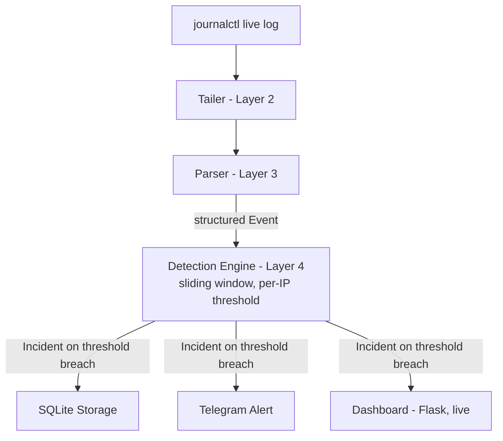

# SSH-IDS — Real-Time SSH Intrusion Detection System

A simple tool that watches SSH login activity live, detects brute-force
patterns, stores incident history, and alerts you via Telegram — with a live
web dashboard to monitor everything in real time.


*(add a screenshot or GIF of the dashboard here before publishing)*

---

## Architecture


Each layer is independently testable and only depends on the structured
output of the layer before it — the detection engine doesn't know what a raw
log line looks like, and the dashboard doesn't know how detection works. It
only reads what's already in the database.

## Features

- **Live log streaming** — reads `journalctl -f` in real time, no polling, no delay
- **Regex-based parsing** — turns raw sshd log text into structured events (handles both IPv4 and IPv6 source addresses)
- **Sliding-window brute-force detection** — configurable threshold (e.g. 3 failed attempts in 120 seconds) tracked independently per source IP
- **Persistent history** — every incident stored in SQLite, auto-pruned after 30 days
- **Telegram alerting** — real-time push notification the moment an incident is detected
- **Live dashboard** — auto-refreshing web view of recent incidents, protected with HTTP Basic Auth and login rate-limiting
- **Automated test suite** — 11 pytest tests covering the parser and detection logic against real captured log data

## Tech Stack

Python 3.11+, Flask, Gunicorn, SQLite, `journalctl`/systemd, Telegram Bot API,
`pytest` for testing.

## Setup

**Requirements:** Linux with systemd (Manjaro, Ubuntu 16+, Fedora, most cloud
distros), Python 3.11+.

```bash
git clone https://github.com/imran601021/sentrySSH.git
cd sentrySSH
```

Install dependencies with whichever Python package manager you prefer —
[`uv`](https://docs.astral.sh/uv/), `pip`, `pipenv`, `poetry`, etc. all work
the same way here. Example using `uv`:

```bash
uv sync
```

Or with plain `pip`:

```bash
pip install -r requirements.txt
```

### Configure secrets

```bash
cp .env.example .env
```

Edit `.env` and fill in:
- `SSH_IDS_TELEGRAM_TOKEN` / `SSH_IDS_TELEGRAM_CHAT_ID` — create a bot via
  [@BotFather](https://t.me/BotFather), message it once, then fetch your chat
  ID from `https://api.telegram.org/bot<TOKEN>/getUpdates`
- `SSH_IDS_DASHBOARD_USER` / `SSH_IDS_DASHBOARD_PASS` — credentials for the
  web dashboard
- `SSH_IDS_UNIT` — your distro's SSH systemd unit name. Check with
  `systemctl status sshd` (most distros) or `systemctl status ssh` (some
  Debian-based systems)

### Run it

Two separate processes, run simultaneously in separate terminals:

```bash
# Terminal 1 — the detection engine
python3 main.py

# Terminal 2 — the dashboard
gunicorn --bind 0.0.0.0:5000 --workers 2 dashboard:app
```

(prefix both with `uv run` if you installed dependencies via `uv`)

Visit `http://localhost:5000` and log in with your dashboard credentials.

### Run the tests

```bash
pytest -v
```

## Known Limitations

Being upfront about what this is *not*, rather than overselling it:

- **Threshold-based detection can be evaded.** Detection works by counting
  failed login attempts from the same IP within a fixed time window (e.g. 3
  attempts in 120 seconds). An attacker who deliberately paces their guesses
  slower than that window — say, one attempt every 3 minutes — will never
  cross the threshold and won't be flagged, even after thousands of
  attempts over time. This isn't a bug in this implementation; it's an
  inherent tradeoff of *any* threshold-based detection approach (Fail2ban's
  default configuration has the same blind spot). Catching slow, patient
  attacks would require a different detection strategy entirely — e.g.
  tracking attempts over much longer time horizons, or flagging IPs with
  any repeated failures regardless of pacing — which trades false positives
  for better slow-attack coverage.
- **Detection state resets on restart.** The sliding-window counters live in
  memory, not on disk. If `main.py` is restarted, in-progress attack
  tracking starts over from zero — an attacker mid-attempt wouldn't be
  flagged based on attempts made before the restart. Incidents already
  confirmed and saved to SQLite before a restart are unaffected and remain
  in history.
- **Single-machine only (SQLite, no multi-host aggregation).** This is
  designed for monitoring one server at a time, and doesn't currently scale
  horizontally across a fleet. We'll look at adding this later — contributions
  welcome if you'd like to take this on in the meantime.

## License

